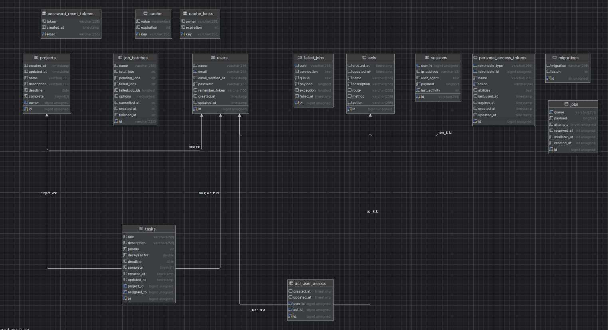

<!-- add titles -->

# Taskify version 2

## Table of Contents

1. [Infrastructure](#infrastructure)
    1. [Backend](#backend)
        1. [Authentication](#authentication)
        2. [Authorization](#authorization)
        3. [Rest API](#rest-api)
    2. [UI](#ui)
        1. [Structure](#structure)
        2. [AuthX](#authx)
        3. [Deployment](#deployment)
    3. [Setup](#setup)

A second installment of the taskify app. This system incorporates a way to manage tasks. Each task belongs to a particular project this allows for easy management especially with the organisation of tasks per project.

## Infrastructure

The project is delivered in one repository. This repository contains both the backend and the frontend. The both services work together using an established REST API provided by the backend written in laravel. The entire application relies on a mysql database that should be readily accessible. The application is run inside containers provided by docker.

### Backend

The backend system presented in this repository contains a REST API built using laravel. This implementation differs from assignment 1 in a sense that all views are implemented in a separate section and an advanced database structure was setup to allow the different relationships between entities. Below lies a graphical representation of the database structure.



#### Authentication

Authentication was implemented as a new feature this time around, the implementation herein was done by using sanctum - a Laravel plugin that handles authentication for rest APIs. This plugin checks for the presence of a valid authorization token and redirects the request or returns a `403` status with a message if the user is authenticated. The nature of the response depends on the nature of the `Accept` header of the request.

#### Authorization

A custom middleware called `watchdog` was created to secure endpoints that need to be authenticated. It does so by querying the database for the permissions granted to the user and does pattern matching to find any permission that grants the user the right to access the specified route with the specified method. All access is denied unless explicitly specified with a `allowed` permission.

Such implementation is achieved by using 3 tables and managing querying between them: `users`, `acls`, `acls_user_assoc`. These 3 tables represent the relation between a person and permissions or `Access Control Lists`. given the many to many relationship between `users` and `acls` a pivot table was created which is `acls_user_assoc`. Permissions are set up when a user is registered depending on which group they belong to either users or admins.

#### Rest API

The api is setup by defining routes in the `api.php` file. Some resources have relationships between each other an example would `projects` and `users`, in order to minimize the amount of api calls made, autopopulation was setup. Autopopulation allows to get desired fields from the other table via the foreign key by doing a `join` with either eloquent or the query builder.

### UI

#### Structure

The UI is built with react. React was chosen for its simplicity and wide body of documentation available. Since the UI is built as a single page application, a few more things were needed to setup properly. Firstly, state management, state management was handled by redux toolkit. redux toolkit manages app-wide state by creating `slices` or portions of your state and giving you reducer functions to manage the said slice.

This was taken further by creating asynchronous thunks to manage api calls and a factory function to create those thunks on our behalf without redefining them with the thunk builder for each action. Custom components were provided to allow re-use, those components are a custom navigation and a custom pagination container to render multiple divisions.

#### AuthX

Authentication and authorization were handled. A custom protected routes component was created to enclose sensitive routes that require authentication. After successful login the user is redirected to the main tasks page. If a protected route is accessed without a token saved in the `localstorage` then the user is redirected back to the login page to authenticate.

#### Deployment

Just like the api, the UI is distributed with inside a docker container this allows for ease setup and increases portability of the system since docker runs anywhere.  The dockerfile for the frontend differs from the one presented in the backend because it includes `nginx` as server to host the build artifacts. An `nginx.conf` was created to define how it should serve the UI. Some of the requirements or rules is that all requests should be redirected to the `index.html` this is because the entirety of the app is compiled into a couple javascript files by vite.

## Setup

In order to setup and run this repository's code the following commands need to be run. It is imperative that Docker be installed on the host PC and that a database is readily available from within docker. a recommended setup requires both docker and database to be installed on windows.

```sh
1. Clone the repository
2. cd ./apps/api
3. php artisan key:generate
4. cp .env.example .env
5. fill up the environment variable.
6. php artisan migrate
7. cd ../../
8. docker compose up --build

```
